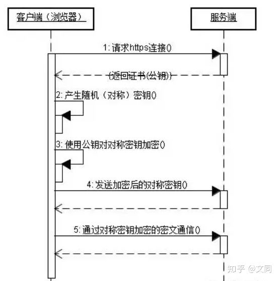

# HTTP 和 HTTPS

## HTTP 协议是什么?

HTTP 协议是超文本传输协议的缩写，英文是 Hyper Text Transfer Protocol。它是从 WEB 服务器传输超文本标记语言(HTML)到本地浏览器的传送协议。

HTTP 是一个基于 TCP/IP 通信协议来传递数据的协议.

一个 http 请求的过程如下：

## http 报文结构

### 请求报文

请求报文构成

- 请求行：包括请求方法、URL、协议/版本
- 请求头(Request Header)
- 请求正文

响应报文构成

- 状态行
- 响应头
- 响应正文

### 常见的请求方法

- GET:请求指定的页面信息，并返回实体主体。
- POST:向指定资源提交数据进行处理请求（例如提交表单或者上传文件）。数据被包含在请求体中。POST 请求可能会导致新的资源的建立和/或已有资源的修改。
- HEAD:类似于 get 请求，只不过返回的响应中没有具体的内容，用于获取报头
- PUT:从客户端向服务器传送的数据取代指定的文档的内容。
- DELETE:请求服务器删除指定的页面。
- OPTION:是一种安全（Safe）的请求，不会修改服务器资源.OPTIONS 有两种常见用途：1.检测服务器所支持的请求方法；2.CORS 中的预检请求。Content-Type: application/json 会触发预检请求。option 请求没有附带请求数据；响应体（Response body）为空

> 注： 浏览器将 CORS 请求分为两类：简单请求（simple request）和非简单请求（not-simple-request）,简单请求浏览器不会预检，而非简单请求会预检。
> 同时满足下列三大条件，就属于简单请求，否则属于非简单请求
>
> 1. 请求方式只能是：GET、POST、HEAD
> 2. HTTP 请求头限制这几种字段：Accept、Accept-Language、>Content-Language、Content-Type、Last-Event-ID
> 3. Content-type 只能取：application/x-www-form-urlencoded、multipart/form-data、text/plain
>
> 非简单请求是对那种对服务器有特殊要求的请求，比如请求方式是 PUT 或者 DELETE，或者 Content-Type 字段类型是 application/json。都会在正式通信之前，增加一次 HTTP 请求，称之为预检。浏览器会先询问服务器，当前网页所在域名是否在服务器的许可名单之中，服务器允许之后，浏览器会发出正式的 XMLHttpRequest 请求，否则会报错

## 响应状态码

### 状态码分类

- 1XX- 信息型，服务器收到请求，需要请求者继续操作。
- 2XX- 成功型，请求成功收到，理解并处理。
- 3XX - 重定向，需要进一步的操作以完成请求。
- 4XX - 客户端错误，请求包含语法错误或无法完成请求。
- 5XX - 服务器错误，服务器在处理请求的过程中发生了错误。

### 常见状态码

- 200 OK - 客户端请求成功
- 301 - 资源（网页等）被永久转移到其它 URL
- 302 - 临时跳转
- 304 Not Modified 未修改。所请求的资源未修改，服务器返回此状态码时，不会返回
  任何资源。客户端通常会缓存访问过的资源，通过提供一个头信息指出客户端希望只返 回在指定日期之后修改的资源,详情查看[浏览器缓存](../浏览器相关/浏览器缓存.md)
- 400 Bad Request - 客户端请求有语法错误，不能被服务器所理解
- 401 Unauthorized - 请求未经授权，这个状态代码必须和 WWW-Authenticate 报头域一起使用
- 403 Forbidden 服务器理解请求客户端的请求，但是拒绝执行此请求
- 404 - 请求资源不存在，可能是输入了错误的 URL
- 500 - 服务器内部发生了不可预期的错误
- Bad Gateway 作为网关或者代理工作的服务器尝试执行请求时，从远程服务器接
  收到了一个无效的响应
- 503 Server Unavailable - 服务器当前不能处理客户端的请求，一段时间后可能恢复正常

## https

HTTPS 协议（HyperText Transfer Protocol over Secure Socket Layer）：一般理解为 HTTP+SSL/TLS，通过 SSL 证书来验证服务器的身份，并为浏览器和服务器之间的通信进行加密。

### SSL 是什么

SSL（Secure Socket Layer，安全套接字层）：1994 年为 Netscape 所研发，SSL 协议位于 TCP/IP 协议与各种应用层协议之间，为数据通讯提供安全支持。

TLS（Transport Layer Security，传输层安全）

### 浏览器在使用 HTTPS 传输数据的流程是什么？

### HTTPS 的缺点

- HTTPS 协议多次握手，导致页面的加载时间延长近 50%；
- HTTPS 连接缓存不如 HTTP 高效，会增加数据开销和功耗；
- 申请 SSL 证书需要钱，功能越强大的证书费用越高。
- SSL 涉及到的安全算法会消耗 CPU 资源，对服务器资源消耗较大。

## 对称加密与非对称加密

### 对称加密

对称加密是加密和解密用的都是同一个密码或同一套逻辑的加密方式

例如对数字 x 加密，x+3 = 10，得出加密后的数字为 10，那么我们可以通过 10-3 = 7 这个逻辑得到加密的 x = 7。

常见的对称加密如：指纹解锁，PIN 码锁，保险箱密码锁，账号密码等

常见的对称加密算法 如 DES 、AES

### 非对称加密

非对称加密中存在两个秘钥，通常将其中一个密钥公开，称为公钥，用于加密；另一个密钥自己保留，称为私钥，用于解密

常见的非对称加密算法如 RSA、DSA、ECC

## http1.0 http1.1 http2 都有哪些变化

### http1.0 与 http1.1

- 新增很多状态码
- 新增 keep-alive
- 新增缓存处理

### http1.1 与 http2.0

- 二进制分帧：在二进制分帧层上，http2.0 会将所有传输信息分割为更小的消息和帧，并对它们采用二进制格式的编码将其封装，新增的二进制分帧层同时也能够保证 http 的各种动词，方法，首部都不受影响，兼容上一代 http 标准
- 多路复用 (Multiplexing) / 连接共享:在 http1.1 中，浏览器客户端在同一时间，针对同一域名下的建立的 tcp 连接数量有限制,chrome 一般是 6 个,为了提高访问速度,http1.1 采用 HTTP Pipelining 技术,但是这个技术会出现很多问题,首先有些代理服务器不能正确的处理 HTTP Pipelining,其次正确的流水线实现是复杂的,所以现代浏览器默认是不开启 HTTP Pipelining 的。多路复用允许同时通过单一的 http/2 连接发起多重的请求-响应消息,多个 HTTP 请求可以在同一个 TCP 连接中并行进行
- 头部压缩：http1.x 的头带有大量信息，而且每次都要重复发送。http/2 使用 encoder 来减少需要传输的 header 大小，通讯双方各自缓存一份头部字段表，既避免了重复 header 的传输，又减小了需要传输的大小。
- 服务端推送

HTTP/1.1 规范中规定了 Pipelining :一个支持持久连接的客户端可以在一个连接中发送多个请求（不需要等待任意请求的响应）。收到请求的服务器必须按照请求收到的顺序发送响应。

> 参考资料
>
> - [深入理解 http2.0 协议，看这篇就够了](https://zhuanlan.zhihu.com/p/89471776)
> - [一篇文章读懂 HTTP1.0 HTTP1.1 HTTP2.0 HTTPS](https://www.jianshu.com/p/1eb384ea0aef)
> - [HTTP/2 相比 1.0 有哪些重大改进](https://www.zhihu.com/question/34074946)
