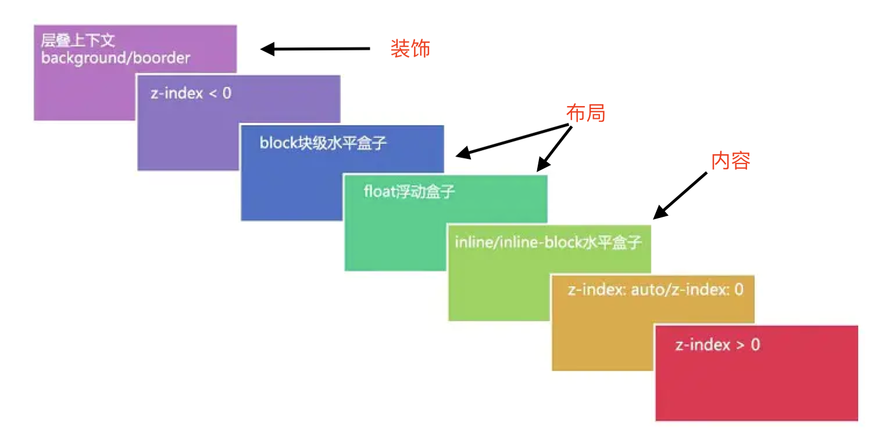

# css 层叠上下文

## 什么是层叠上下文

层叠上下文是 html 中三维的概念，可理解为，屏幕的宽高就是 x，y 轴，眼睛看向屏幕的方向为 z 轴

## 层叠水平

- 文档默认是在根层叠上下文`<html>`，这也是为什么绝对定位元素在没有其它定位元素限制的时候默认相对根元素定位的原因。
- 层叠上下文可以嵌套，即一个层叠上下文中可以包含另外一个层叠上下文，这样就形成了不同的层叠水平
- 只有在相同的层叠上下文中的元素对比它们的层叠水平才有意义

## 层叠顺序

当元素发生层叠时，遵循下图中的规则

很明显 z-index 的数值越大，就越靠前。除此之外还需要注意的两点

1. inline/inline-block 内联元素，为网页的内容，网页内容的层叠顺序高于浮动元素和块状元素这些布局。
2. 后来居上原则，若两个元素的层叠顺序一样，后面的元素会覆盖前面的元素。

## 创建层叠上下文

后 8 种方式为 CSS3 与新时代的层叠上下文

1. 根层叠上下文，默认的。
2. 定位元素 z-index 不是 auto 的情况下，会创建层叠上下文。
3. z-index 不是 auto 的 flex/inline-flex 布局中的元素
4. 元素的 opacity 值不是 1
5. 元素的 transform 不是 none
6. 元素 mix-blend-mode 值不是 normal.
7. 元素的 filter 值不是 none.
8. 元素的 isolation 值是 isolate.
9. will-change 指定的属性值为上面任意一个。
10. 元素的-webkit-overflow-scrolling 设为 touch.

参考[深入理解 CSS 中的层叠上下文和层叠顺序
](https://www.zhangxinxu.com/wordpress/2016/01/understand-css-stacking-context-order-z-index/)
