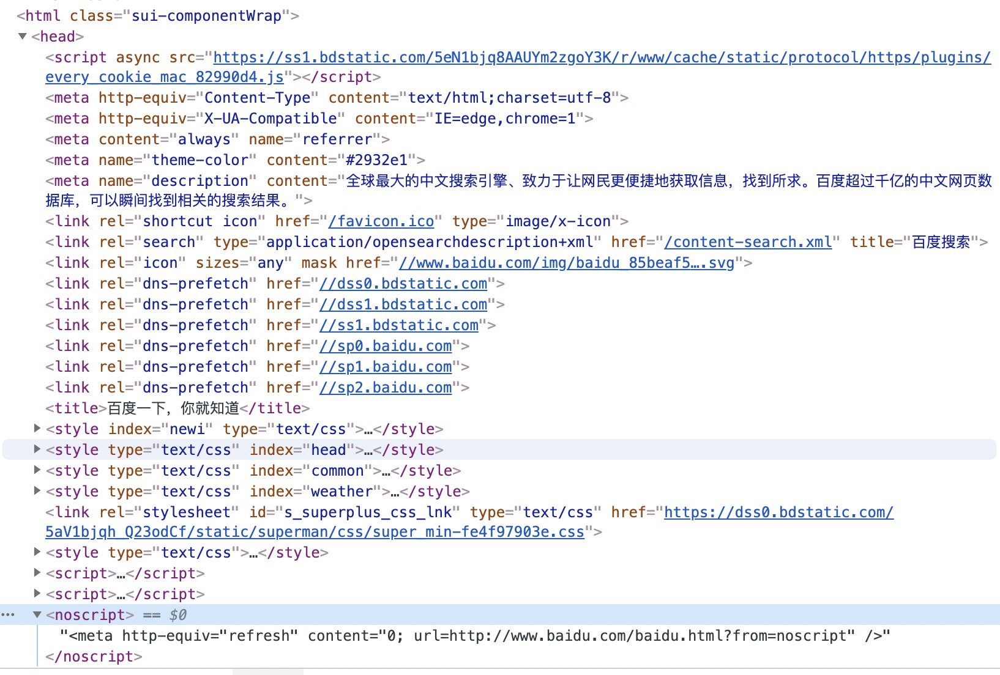

## meta 标签

meta 元素定义的元数据的类型包括以下几种：

- 如果设置了 name 属性，meta 元素提供的是文档级别（document-level）的元数据，应用于整个页面。
- 如果设置了 http-equiv 属性，meta 元素则是编译指令，提供的信息与类似命名的 HTTP 头部相同。
- 如果设置了 charset 属性，meta 元素是一个字符集声明，告诉文档使用哪种字符编码。
- 如果设置了 itemprop 属性，meta 元素提供用户定义的元数据。

### 深入 http-equiv

包含如下值都是特定 HTTP 头部

- content-security-policy，定义当前页面的内容策略，指定允许的服务器源和脚本端点，防止跨站点脚本攻击（xss）
- content-type，使用这个属性，其值必须是"text/html; charset=utf-8"，且该属性只能用于 MIME type 为 text/html 的文档，不能用于 MIME 类型为 XML 的文档
- default-style 默认的 css 表
- refresh，如果 content 只包含正整数，则为该页面重新载入的间隔时间，若还包括 url 则为重定向到该链接的时间间隔
- X-UA-Compatible

  ```html
  <!-- Redirect page after 3 seconds -->
  <meta http-equiv="refresh" content="3;url=https://www.mozilla.org" />
  <meta http-equiv="Content-Type" content="text/html;charset=utf-8" />
  <meta http-equiv="X-UA-Compatible" content="IE=edge,chrome=1" />
  ```

### 深入 name

name 和 content 属性可以一起使用，以名-值对的方式给文档提供元数据，其中 name 作为元数据的名称，content 作为元数据的值

name 的值

- html 规范定义的名称常见的有`application-name`，`author`,`description`,`keywords`,`referrer`,`theme-color`
- css 相关的名称有`viewport`

了解更多参考<https://wiki.developer.mozilla.org/zh-CN/docs/Web/HTML/Element/meta/name>

### 列举几个网站的 head 设置

- 百度首页
  

## Html 的全局属性 data-\*

作用：使用 data-\* 属性来嵌入自定义数据

```html
<ul>
  <li data-animal-type="鸟类" id="bird">喜鹊</li>
  <li data-animal-type="鱼类">金枪鱼</li>
  <li data-animal-type="蜘蛛">蝇虎</li>
</ul>
```

js 获取 data 的数据

```js
document.getElementById("#bird"), getAttribute("data-animal-type");
```
