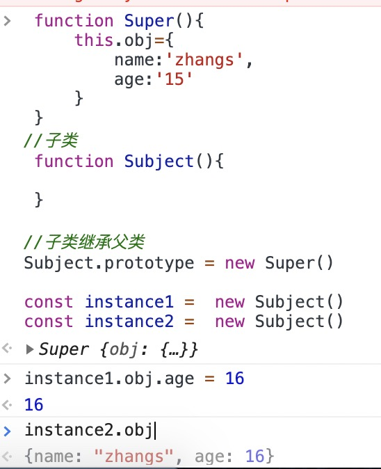

# js 的原型链与继承

## 原型链

### 如何理解原型

下面几条必须记住并且理解

- 所有的引用类型（数组、对象、函数），都具有对象特性，即可自由扩展属性（`null`除外）
- 所有的引用类型（数组、对象、函数），都有一个`__proto__`属性，属性值是一个普通的对象
- 所有的函数，都有一个`prototype`属性，属性值也是一个普通的对象（bind 的返回的函数除外）
- 所有的引用类型（数组、对象、函数），`__proto__`属性值指向它的构造函数的`prototype`属性值

那么如何判断这个属性是不是对象本身的属性呢？使用`hasOwnProperty`，常用的地方是遍历一个对象的时候

```js
var item;
for (item in f) {
  // 高级浏览器已经在 for in 中屏蔽了来自原型的属性，但是这里建议大家还是加上这个判断，保证程序的健壮性
  if (f.hasOwnProperty(item)) {
    console.log(item);
  }
}
```

### 如何理解 JS 的原型链

当试图得到一个对象的某个属性时，如果这个对象本身没有这个属性，那么会去它的`__proto__`（即它的构造函数的`prototype`）中寻找，如果也没有就会去它的`__proto__.__proto__`中去寻找，这样一直往上找，你会发现是一个链式的结构，所以叫做“原型链”。如果一直找到最上层都没有找到，那么就宣告失败，返回`undefined`。最上层是什么 —— `Object.prototype.__proto__ === null`

```js
// 定义一个实例字面量a，a的原型链指向构造函数的原型对象（prototype）
let a = {};
a.__proto__ === Objcet.prototype; // true
// 即a.[[Prototype]]指针指向 Objcet.prototype
// __proto__是一个私有属性，JavaScript 的非标准但许多浏览器实现的属性,如Firefox、Safari和Chrome
// 在es6中定义的 Object.getPrototypeOf() 和 Object.getPrototypeOf() 访问器访问 a.[[Prototype]]
```

### 原型,原型链,构造函数三者之间的关系

```js
// instance为实例 Object为构造函数 原型为 Object.prototype
const instance = new Object();
// 可理解为实例的原型链指向原型即 实例.__proto__ === 原型
instance.__proto__ === Object.prototype; // true
// 可理解为原型的构造函数就是构造函数本身 即 原型.constructor === 构造函数
Object.prototype.constructor === Object; //true

// 构造函数的原型就是原型本身 即 构造函数.prototype === 原型
Object.prototype === Object.prototype;
```

## 继承

继承就是子类拥有父类所有的方法和属性

### 基于原型的继承

实现原理

父类的实例赋值给子类的原型对象（prototype ）

```js
// 父类
function Super() {
  this.obj = {
    name: "zhangs",
    age: "15",
  };
}
//子类
function Subject() {}

//子类继承父类
Subject.prototype = new Super();

const instance1 = new Subject();
const instance2 = new Subject();
```

原型继承的问题

如果父类中有引用类型的属性，则创建的多个实例后，修改其中一个属性，则会影响其它实例的属性,同理在给父类构造函数传递参数的时候也会影响其他实例


### 构造函数继承

```js
function Parent() {}

Parent.prototype.getName = function () {
  console.log("Parent");
};

function Child() {
  // 执行下面的方法只能继承 Parent子的本身的方法，Parent.prototype.getName却无法继承
  Parent.call(this);
}

const instance = new Child();
```

### 组合继承

```js
function Parent() {}

function Child() {
  // 第二次执行 Parent
  Parent.call(this);
}
// 第一次执行 Parent
Child.prototype = new Parent();
Child.prototype.constructor = Child;

const instance = new Child();
```

### 原型式继承（后面三种方式都是基于 Object.create()）

#### Object.create()的实现方式

```js
function createObj(o) {
  function F() {}
  F.prototype = o;
  return new F();
}
```

```js
const Parent = {
  getName: function () {
    console.log(getName);
  },
};

const instance1 = Object.create(Parent);
const instance2 = createObj(Parent);

// 通过Object.create() 不仅可以继承Parent的自身属性，还可以继承原型上的属性
```

### 寄生继承

```js
function createObj(o) {
  var clone = Object.create(o);
  clone.sayName = function () {
    console.log("hi");
  };
  return clone;
}

const instance2 = createObj(Parent);
```

### 寄生组合式继承

```js
// objectcreate 创建方式
function object(o) {
  function F() {}
  F.prototype = o;
  return new F();
}

function prototype(child, parent) {
  // var prototype = Object.create(parent.prototype)
  var prototype = object(parent.prototype);
  prototype.constructor = child;
  child.prototype = prototype;
}

// 当我们使用的时候：
prototype(Child, Parent);
```

```js
// mdn polyfill
function _possibleConstructorReturn(self, call) {
  // ...
  return call && (typeof call === "object" || typeof call === "function")
    ? call
    : self;
}
function _inherits(subClass, superClass) {
  // 这里可以看到
  subClass.prototype = Object.create(superClass && superClass.prototype, {
    constructor: {
      value: subClass,
      enumerable: false,
      writable: true,
      configurable: true,
    },
  });
  if (superClass)
    Object.setPrototypeOf
      ? Object.setPrototypeOf(subClass, superClass)
      : (subClass.__proto__ = superClass);
}

var Parent = function Parent() {
  // 验证是否是 Parent 构造出来的 this
  _classCallCheck(this, Parent);
};

var Child = (function (_Parent) {
  _inherits(Child, _Parent);
  function Child() {
    _classCallCheck(this, Child);
    return _possibleConstructorReturn(
      this,
      (Child.__proto__ || Object.getPrototypeOf(Child)).apply(this, arguments)
    );
  }
  return Child;
})(Parent);
```

## es5 中的继承与 es6 的 extends

ES5 的继承，实质是先创造子类的实例对象 this，然后再将父类的方法添加到 this 上面（Parent.apply(this)）。ES6 的继承机制完全不同，实质是先将父类实例对象的属性和方法，加到 this 上面（所以必须先调用 super 方法），然后再用子类的构造函数修改 this。

子类必须在 constructor 方法中调用 super 方法，否则`新建实例`时会报错。这是因为子类自己的 this 对象，必须先通过父类的构造函数完成塑造，得到与父类同样的实例属性和方法，然后再对其进行加工，加上子类自己的实例属性和方法。如果不调用 super 方法，子类就得不到 this 对象。

`如果子类没有定义constructor方法，这个方法会被默认添加`

```js
class ColorPoint extends Point {}

// 等同于
class ColorPoint extends Point {
  constructor(...args) {
    super(...args);
  }
}
```

## 如何判断一个子类是否继承父类

Object.getPrototypeOf 方法可以用来从子类上获取父类, 因此，可以使用这个方法判断，一个类是否继承了另一个类。

```js
Object.getPrototypeOf(Son)) === Parent;
```

参考资料:

[阮一峰 Class 的继承](https://es6.ruanyifeng.com/#docs/class-extends)
