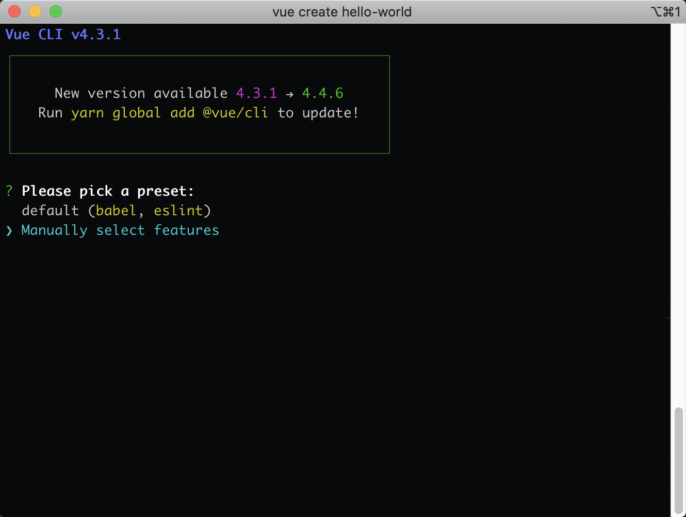
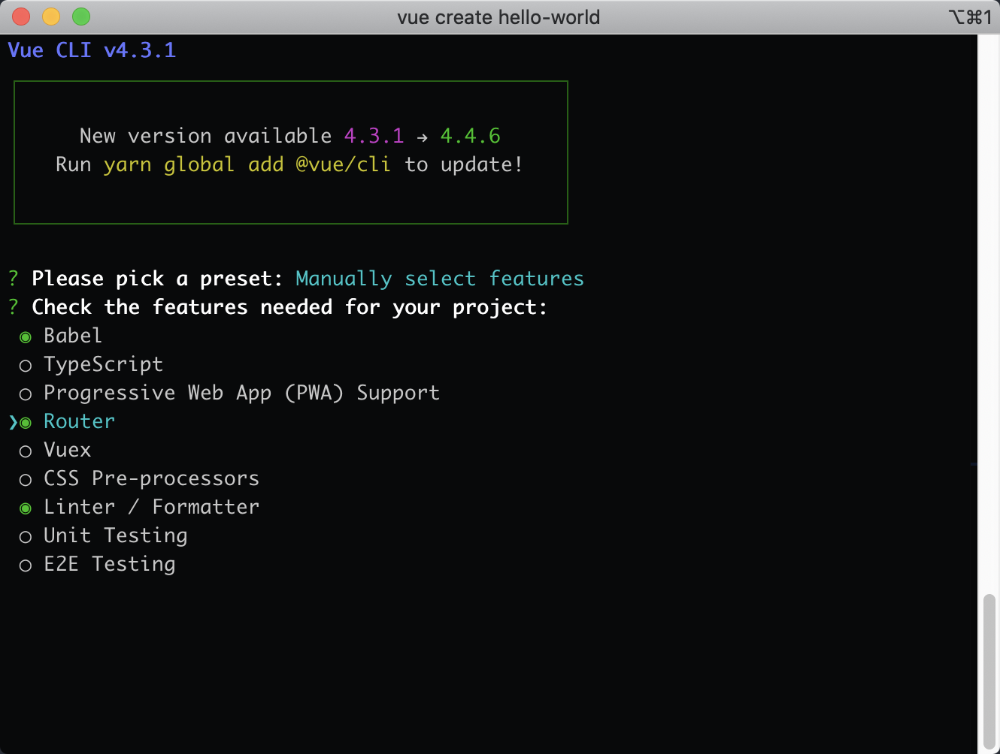
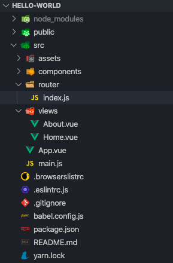
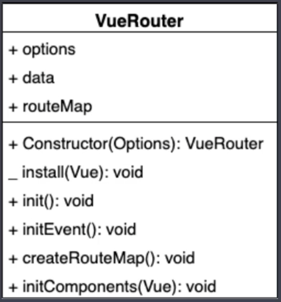
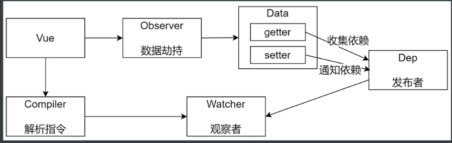
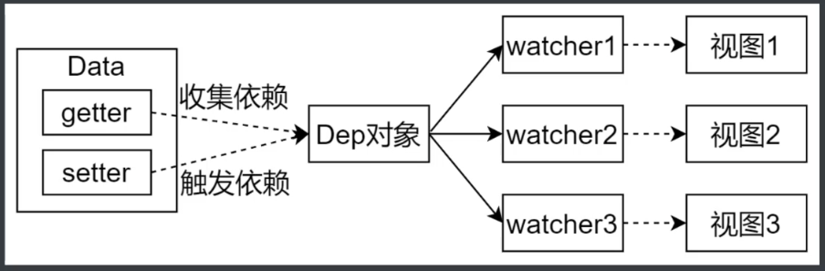

# Vue.js 框架

## Vue 的基础结构

```html
<!DOCTYPE html>
<html lang="en">
  <head>
    <meta charset="UTF-8" />
    <meta name="viewport" content="width=device-width, initial-scale=1.0" />
    <title>render</title>
  </head>

  <body>
    <div id="app"></div>
    <script src="https://cdn.jsdelivr.net/npm/vue/dist/vue.js"></script>

    <script>
      new Vue({
        data: {
          company: {
            name: "name",
            address: "some address",
          },
        },
        render(h) {
          return h("div", [
            h("p", "公司名称：" + this.company.name),
            h("p", "公司地址：" + this.company.address),
          ]);
        },
      }).$mount("#app");
    </script>
  </body>
</html>
```

## vue 的生命周期

创建 vue 实例的过程

1. 初始化事件和生命周期(包括生命周期的 api 和 h 方法)
2. 触发 beforeCreate 钩子函数
3. 初始化注入(将 props,date,method 等成员注入 vue 实例中)
4. 触发 created 钩子函数(在此时可以访问到 vue 实例中的成员),此时实例创建完毕

编译模板的过程

1. 判断选项中是否有 el 选项,如果没有设置则调用 vm.\$mount(el),此方法将 el 转换为 template.
2. 接着将 template 转换成 render 函数. 判断是否指定 template 选项, 如果没有设置则将 el 的外部 HTML 作为模板, 编译到渲染函数 render 中,生成虚拟 dom.

挂载 dom

1. 挂载之前触发 beforeMount 函数, 在此时无法访问到新的 dom 元素
2. 渲染 dom, 将新的元素渲染到界面上
3. 触发 mounted 方法,此时 dom 挂载完毕, 可以访问到新的 dom 元素
4. 当 date 被修改时,触发 beforeUpdate 方法, 然后进行新旧两个虚拟 dom 的对比,将差异渲染到界面中
5. 触发 updated

销毁阶段

1. 当调用 vn.\$destroy()时,首先触发 beforeDestroy 方法
2. 执行清理工作
3. 销毁完毕触发 destroyed 方法

整个过程的生命周期示意图如下:


## vue 语法

- 插值表达式
- 指令,内置 14 个
- 计算属性和侦听器
- class 和 style 绑定
- 条件渲染和列表渲染
- 表单输入绑定

## Vue Router

### Vue Router 的基本使用步骤

官方文档 <https://router.vuejs.org/zh/>

使用 vue-cli 创建项目的时候选择手动配置预设的插件



然后选择 vue-router 插件



项目目录如下



1. 首先在`router/index.js`文件中,注册路由并设置路由规则

```js
import Vue from "vue";
import VueRouter from "vue-router";
import Home from "../views/Home.vue";
// 1. 注册路由插件
Vue.use(VueRouter);
// 路由规则
const routes = [
  {
    path: "/",
    name: "Home",
    component: Home,
  },
  {
    path: "/about",
    name: "About",
    // route level code-splitting
    // this generates a separate chunk (about.[hash].js) for this route
    // which is lazy-loaded when the route is visited. (懒加载)
    component: () =>
      import(/* webpackChunkName: "about" */ "../views/About.vue"),
  },
];

// 2. 创建 router 对象, 然后导出
const router = new VueRouter({
  routes,
});

export default router;
```

2. 在`main.js`中,在 new Vue 实例时注册 router 对象, 这个动作会在 vue 的实例中添加两个属性分别是`$route`和`$router`.

- `$route`存储路由规则
- `$router`是 vue-router 的实例,其中有相关的属性和方法

```js
import Vue from "vue";
import App from "./App.vue";
import router from "./router";

Vue.config.productionTip = false;

new Vue({
  // 3. 注册 router 对象
  router,
  render: (h) => h(App),
}).$mount("#app");
```

3. 在`App.vue`中使用

```html
<template>
  <div id="app">
    <div id="nav">
      <!-- 5. 创建链接 -->
      <router-link to="/">Home</router-link> |
      <router-link to="/about">About</router-link>
    </div>
    <!-- 4. 创建路由组建的占位 -->
    <router-view />
  </div>
</template>
```

### 动态路由匹配

配置路由规则设置 path 后面添加`:id`这种动态路径参数的方式实现

```js
const routes = [
  {
    path: "/",
    name: "Index",
    component: Index,
  },
  {
    path: "/detail/:id",
    name: "Detail",
    // 开启 props，会把 URL 中的参数传递给组件
    // 在组件中通过 props 来接收 URL 参数
    props: true,
    // route level code-splitting
    // this generates a separate chunk (about.[hash].js) for this route
    // which is lazy-loaded when the route is visited.
    component: () =>
      import(/* webpackChunkName: "detail" */ "../views/Detail.vue"),
  },
];
```

这个参数`id`会被设置到`this.$route.params`,所以我们可以在模板中使用这个参数;
如果设置了`props:true`的属性,则可以直接在组件的 props 中获取这参数

```html
<template>
  <div>
    <!-- 方式1： 通过当前路由规则，获取数据 -->
    通过当前路由规则获取：{{ $route.params.id }}

    <br />
    <!-- 方式2：路由规则中开启 props 传参 -->
    通过开启 props 获取：{{ id }}
  </div>
</template>

<script>
  export default {
    name: "Detail",
    props: ["id"],
  };
</script>
```

### 嵌套路由

通常由多层嵌套的组件组合而成, URL 中各段动态路径也按某种结构对应嵌套的各层组件.

通俗的理解在`App.vue`中, `<router-view>` 相当于是最顶层的路由出口,这里渲染的是最高级路由匹配,被渲染的组件`User`里面也可以包含自己的`<router-view>`

```html
<div id="app">
  <router-view></router-view>
</div>
```

```js
const router = new VueRouter({
  routes: [{ path: "/user/:id", component: User }],
});
```

要在子组件的出口中渲染,则需要更改路由规则

```js
const router = new VueRouter({
  routes: [
    {
      path: "/user/:id",
      component: User,
      children: [
        {
          // 当 /user/:id/profile 匹配成功，
          // UserProfile 会被渲染在 User 的 <router-view> 中
          path: "profile",
          component: UserProfile,
        },
        {
          // 当 /user/:id/posts 匹配成功
          // UserPosts 会被渲染在 User 的 <router-view> 中
          path: "posts",
          component: UserPosts,
        },
      ],
    },
  ],
});
```

### 编程式导航

除了使用 `<router-link>`创建 a 标签来定义导航链接，我们还可以借助 router 的实例方法，通过编写代码来实现。

| 申明式                    | 编程式             |
| ------------------------- | ------------------ |
| `<router-link :to="...">` | `router.push(...)` |

- `this.$router.push()`这个方法会向 history 栈添加一个新的记录，所以，当用户点击浏览器后退按钮时，则回到之前的 URL。
- `this.$router.replace()`方这个会替换掉当前的 history 记录
- `this.$router.go()`这个方法的参数是一个整数，意思是在 history 记录中向前或者后退多少步

### hash 模式和 history 模式

都是客户端的实现方式,不会向服务器发送请求

#### 表现形式

- Hash 模式 `https://music.163.com/#/playlist?id=292292929`
- history 模式 `https://music.163.com/playlist?id=292292929`

#### 原理区别

- hash 模式是基于锚点以及 onhashchange 事件,通过锚点的值作为路径地址,当地址发现变化触发 onhashchange 事件,根基路径决定页面的内容
- history 模式是基于 HTML5 中的 history api 实现的,history.pushState(),history.replaceState(), ie 10 以上的版本才支持

#### history 模式的使用

- 为什么需要服务器端的支持? 因为在单页应用中服务器端不存在`http://www.testurl.com/login`这样的地址, 就会返回 404

- 解决办法:在服务器端应该出了静态资源外都返回单页应用的 index.html

1. 在创建 router 对象是传入`mode: "history"`, 默认是 hash 模式

```js
const router = new VueRouter({
  mode: "history",
  routes,
});
```

2. 服务端配置

node.js 配置
注册 history 模式的中间件

```js
const path = require("path");

// 导入处理 history 模式的模块
const history = require("connect-history-api-fallback");
// 导入 express
const express = require("express");

const app = express();
// 注册处理 history 模式的中间件
app.use(history());
// 处理静态资源的中间件，网站根目录 ../web
app.use(express.static(path.join(__dirname, "../web")));

// 开启服务器，端口是 3000
app.listen(3000, () => {
  console.log("服务器开启，端口：3000");
});
```

nginx 配置

```
location / {
root html;
index index.html index.htm;
// 按顺序检查文件是否存在,如果所有的文件都找不到，会进行一个内部重定向到最后一个参数
try_files $uri $uri/ /index.html

}
```

### 手写 vue-router

#### vue-router 实现原理

- hash 模式
  - url 中#后面的内容作为路径的地址
  - 监听 hashchange 事件
  - 根据当前的路由地址找到对应组件重新渲染
- history 模式
  - 通过 history.pushState()方法改变地址栏
  - 监听 popstate 事件
  - 根据当前路由地址找到对应组件重新渲染

#### vue-router UML 类图



### vue 响应式原理

主要有 5 个类组成



- Vue 的作用是把 data 属性注入到 vue 实例中,并且调用 Observer 和 Compiler
- Observer 的作用是数据劫持,监听数据的变化,把 data 中的属性变成 getter 和 setter
- Compiler 负责解析指令和插值表达式
- Dep 负责收集依赖,在 getter 中收集依赖添加观察者,在 setter 中通知依赖,通知观察者
- watcher 当数据发生变化时触发依赖,dep 通知所有的 watcher 实例更新视图,自身实例化的时候往 dep 对象中添加自己

#### watcher


